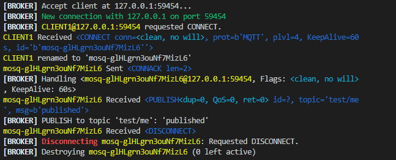

# NIIP-Labo 3 MQTT & ZigBee
> **Bram Kelchtermans, William Thenaers**

## Part 1: MQTT broker

To run the broker, use (from inside the broker directory):

```sh
python3 main.py 
```

Or run python directly and use:

```python
from mqtt.mqtt_broker import MQTTBroker

# Change host to the IP of the local machine, or empty for localhost
broker = MQTTBroker(host="", port=MQTTBroker.PORT)
broker.start()
```

**WARNING** The implementation requires the Python `select` module to have `select.poll()` available that can be used on socket objects. This is **not** the case in Windows, so a *nix subsystem is required (e.g. Ububtu or WSL).


#### Example Subscriber output


#### Example Publisher output




#### Topic matching

To test topic matching, run the topic_matcher from inside the `broker` directory as:
```sh
python3 -m mqtt.topic_matcher
```

Optionally add more test rules to the file.